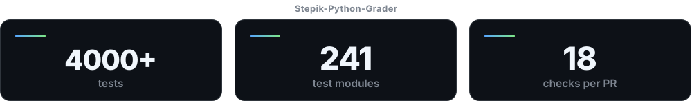

<div align="center">

<picture>
  <source media="(prefers-color-scheme: dark)" srcset="./assets/header-dark.svg">
  <source media="(prefers-color-scheme: light)" srcset="./assets/header-light.svg">
  
</picture>

<br>

<picture>
  <source media="(prefers-color-scheme: dark)" srcset="./assets/typing-dark.svg">
  <source media="(prefers-color-scheme: light)" srcset="./assets/typing-light.svg">
  
</picture>

<br>

<picture>
  <source media="(prefers-color-scheme: dark)" srcset="./assets/metrics-dark.svg">
  <source media="(prefers-color-scheme: light)" srcset="./assets/metrics-light.svg">
  
</picture>

<br><br>

<a href="https://github.com/ArtVsMark/Stepik-Python-Grader"></a>
<a href="https://pypi.org/project/stepik-python-grader/"></a>
<a href="https://github.com/ArtVsMark/Stepik-Python-Grader/actions/workflows/ci.yml"></a>

<br>

<picture>
  <source media="(prefers-color-scheme: dark)" srcset="./assets/divider-dark.svg">
  <source media="(prefers-color-scheme: light)" srcset="./assets/divider-light.svg">
  
</picture>

</div>

## What I maintain

| Project | What it does | Stack |
|---|---|---|
| **[Stepik-Python-Grader](https://github.com/ArtVsMark/Stepik-Python-Grader)**<br><sub>[PyPI](https://pypi.org/project/stepik-python-grader/) · [Quick start](https://github.com/ArtVsMark/Stepik-Python-Grader/blob/main/README.en.md#quick-start-no-stepik-needed) · [History](https://github.com/ArtVsMark/Stepik-Python-Grader/blob/main/HISTORY.md)</sub> | A local offline autograder for Python. Downloads task data from Stepik, runs correctness checks without a submit limit, and **compares several solutions honestly** — correctness first, benchmark metrics second. | <sub>CLI · web UI · GUI · pytest plugin · OS sandbox</sub> |
| **[Glossary-Python](https://github.com/ArtVsMark/Glossary-Python)** | Supporting layer: the glossary the grader links into when a run fails. | <sub>content · tooling</sub> |
| **[claude-code-playbook](https://github.com/ArtVsMark/claude-code-playbook)** | <!--m:rules-->125<!--/m:rules--> rules for running agent sessions and a GitHub pipeline — each one carrying the incident it grew from, not just the wording. Russian and English. | <sub>docs · RU/EN</sub> |
| **[claude-code-usage](https://github.com/ArtVsMark/claude-code-usage)** | Turns a three-step limit indicator into an actual number: measures what a session spent, calibrates its own scale, reports what is left. Early — the spec is written, the tool is not. | <sub>Python · JSONL over git</sub> |

<sub><b>Quick start</b></sub>

```bash
pipx install stepik-python-grader && stepik-grader
```

**Beyond running tests:** an offline RU/EN glossary of <!--m:glossary-->1349<!--/m:glossary--> ready cards, reachable straight from the error you just hit · a step-by-step tracer with a memory graph · `timeit` microbenchmarks with time and memory ranking · an optional OS-level sandbox, kernel-enforced on Linux and macOS and partial on Windows, where the missing network isolation is a [named gap](https://github.com/ArtVsMark/Stepik-Python-Grader/blob/main/SECURITY.md#гарантии-по-ос-асимметрия--не-баг-задокументированный-компромисс), not an oversight · opt-in AI failure explanations, bring-your-own-key.

<div align="center">
<picture>
  <source media="(prefers-color-scheme: dark)" srcset="./assets/divider-dark.svg">
  <source media="(prefers-color-scheme: light)" srcset="./assets/divider-light.svg">
  
</picture>
</div>

## What holds the quality

<!--m:modules-->210<!--/m:modules--> test modules · <!--m:required-->11<!--/m:required--> required checks on `main` · <!--m:os-->3<!--/m:os--> OS × <!--m:py-->2<!--/m:py--> Python versions, <!--m:exp-->3.14<!--/m:exp--> experimental · <!--m:releases-->12<!--/m:releases--> releases shipped

- **Gates instead of memory** — `preflight.py` before a commit, `check_pr_ready.py` before a merge. Things you cannot forget, because they are enforced rather than remembered.
- **The gate is a ruleset, not an agreement** — what protects `main` is public, and you can read it without taking my word: every required check green, on a branch already up to date with `main`, force-push and deletion refused. [See for yourself](https://api.github.com/repos/ArtVsMark/Stepik-Python-Grader/rules/branches/main).
- **Every rule cites its incident** — each convention carries the issue number it grew from, and the incidents themselves live in a [public catalogue](https://github.com/ArtVsMark/claude-code-playbook). Half a year later it is clear not only *what* the rule is, but *why*.
- **A changelog assembled from fragments**, not written after the fact — entries land with the change that caused them.
- **The numbers above are measured, not typed** — a [daily job](./.github/workflows/metrics.yml) reads them from the repositories that produce them and rewrites this page. A number nobody measures is a number that rots.

<div align="center">
<picture>
  <source media="(prefers-color-scheme: dark)" srcset="./assets/divider-dark.svg">
  <source media="(prefers-color-scheme: light)" srcset="./assets/divider-light.svg">
  
</picture>
</div>

## Current focus

| | |
|---|---|
| **CI & merge automation** | stronger gates, less manual shepherding |
| **Regression coverage** | every fixed bug leaves a test behind |
| **English documentation** | full parity with the Russian docs tree |
| **Local web UX** | making `--serve` the primary workflow, not the fallback |

<div align="center">
<picture>
  <source media="(prefers-color-scheme: dark)" srcset="./assets/divider-dark.svg">
  <source media="(prefers-color-scheme: light)" srcset="./assets/divider-light.svg">
  
</picture>
</div>

## Stack

<div align="center">

`Python` · `pytest` · `Hypothesis` · `Ruff` · `mypy` · `GitHub Actions` · `PyPI` · `Playwright`

<sub>CLI tooling · local web UI · benchmarking · OS sandboxing · docs architecture · release automation · typed boundaries · property-based testing</sub>

</div>

<div align="center">
<picture>
  <source media="(prefers-color-scheme: dark)" srcset="./assets/divider-dark.svg">
  <source media="(prefers-color-scheme: light)" srcset="./assets/divider-light.svg">
  
</picture>
</div>

## Contributions welcome

The grader has a **"First contribution in 15 minutes"** onramp, and every `good first issue` is written in **both Russian and English** — a bilingual body is enforced by a dedicated check, not by good intentions. Open right now: **<!--m:gfi-->4<!--/m:gfi-->** — the count is rebuilt from the tracker daily, and an empty pool means none are waiting this minute, not that the door is closed.

<div align="center">

<a href="https://github.com/ArtVsMark/Stepik-Python-Grader/labels/good%20first%20issue"></a>
<a href="https://github.com/ArtVsMark/Stepik-Python-Grader/discussions"></a>
<a href="https://github.com/ArtVsMark/Stepik-Python-Grader/issues/new/choose"></a>

</div>

<div align="center">
<picture>
  <source media="(prefers-color-scheme: dark)" srcset="./assets/divider-dark.svg">
  <source media="(prefers-color-scheme: light)" srcset="./assets/divider-light.svg">
  
</picture>
</div>

### 🇷🇺 По-русски

**Мейнтейнер open-source на Python.** Флагман — [Stepik-Python-Grader](https://github.com/ArtVsMark/Stepik-Python-Grader):
локальный грейдер, который не просто прогоняет тесты, а **сравнивает решения честно** — сначала по
корректности, потом по benchmark-метрикам. Рядом — [claude-code-playbook](https://github.com/ArtVsMark/claude-code-playbook),
каталог правил, каждое с историей поломки, из которой выросло, и [claude-code-usage](https://github.com/ArtVsMark/claude-code-usage) —
остаток лимитов Claude Code в цифрах вместо трёхступенчатого светофора; пока спецификация.

Качество держится механикой, а не памятью: гейты перед коммитом и мержем, зелёный CI на актуальной
ветке как условие мержа, числа на этой странице пересобирает
[отдельный workflow](./.github/workflows/metrics.yml), а не автор.

Подробности — в самих проектах: [README грейдера](https://github.com/ArtVsMark/Stepik-Python-Grader#readme) (на русском) · [история](https://github.com/ArtVsMark/Stepik-Python-Grader/blob/main/HISTORY.md) · [как включиться](https://github.com/ArtVsMark/Stepik-Python-Grader/blob/main/CONTRIBUTING.md)

<div align="center">

<picture>
  <source media="(prefers-color-scheme: dark)" srcset="https://raw.githubusercontent.com/ArtVsMark/ArtVsMark/output/snake-dark.svg">
  <source media="(prefers-color-scheme: light)" srcset="https://raw.githubusercontent.com/ArtVsMark/ArtVsMark/output/snake-light.svg">
  
</picture>

</div>
