<div align="center">

<picture>
  <source media="(prefers-color-scheme: dark)" srcset="./assets/header-dark.svg">
  <source media="(prefers-color-scheme: light)" srcset="./assets/header-light.svg">
  
</picture>

<br><br>

**Open-source Python maintainer.** I build practical developer tooling for checking,<br>comparing, debugging and shipping Python code with more confidence.

<br>

<a href="https://github.com/ArtVsMark/Stepik-Python-Grader"></a>
<a href="https://pypi.org/project/stepik-python-grader/"></a>
<a href="https://github.com/ArtVsMark/Stepik-Python-Grader/actions/workflows/ci.yml"></a>
<a href="https://github.com/ArtVsMark?tab=followers"></a>

</div>

<br>

---

<div align="center">

### 🎓 Stepik-Python-Grader

**A local offline autograder for Python** — run, benchmark and compare solutions,<br>with an optional OS sandbox, a local web UI and a GUI launcher.

<a href="https://github.com/ArtVsMark/Stepik-Python-Grader">
  
</a>

<br><br>

```bash
pipx install stepik-python-grader && stepik-grader
```

<a href="https://github.com/ArtVsMark/Stepik-Python-Grader"><b>Repository</b></a> ·
<a href="https://pypi.org/project/stepik-python-grader/">PyPI</a> ·
<a href="https://github.com/ArtVsMark/Stepik-Python-Grader/blob/main/README.en.md">Quick start</a> ·
<a href="https://github.com/ArtVsMark/Stepik-Python-Grader/blob/main/HISTORY.md">Project history</a>

</div>

<br>

It downloads task data from Stepik automatically, runs correctness checks locally without a submit limit, and — the part that makes it more than a test runner — **compares several solutions honestly**: correctness first, benchmark metrics second. The whole workflow is exposed through **CLI**, **local web UI**, **GUI launcher** and a **pytest plugin**.

<table>
<tr>
<td width="50%" valign="top">

<p align="center"><sub><b>Verdicts with time and memory</b> — ranking, not just pass/fail</sub></p>
</td>
<td width="50%" valign="top">

<p align="center"><sub><b>Offline glossary</b> — reachable straight from the error you just hit</sub></p>
</td>
</tr>
</table>

<details>
<summary><b>⚙️ Beyond basic test execution</b></summary>

<br>

| Capability | What it does |
|---|---|
| 🔍 **Offline glossary** | Bilingual RU/EN Python glossary, reachable straight from the error you just hit |
| 🧭 **Trace-based debugging** | Step-by-step tracer with a memory graph |
| ⏱️ **Subprocess benchmarking** | `timeit` microbenchmarks plus time and memory ranking across solutions |
| 🛡️ **OS-level sandboxing** | Optional execution boundary for Linux, macOS and Windows |
| 🤖 **AI failure explanations** | Opt-in, bring-your-own-key — never on by default |
| 📈 **Progress & history** | Tracks your recurring mistakes so they can be revisited |
| 📚 **Layered docs** | Split by audience: `use` · `dev` · `agent` · `audit` · `archive` |

</details>

<br>

---

## 🛠 What holds the quality

The project doubles as a proving ground for engineering discipline. What sits behind the green check:

<table>
<tr>
<td align="center" width="25%"><h3>4000+</h3><sub>tests across a<br>197-module suite</sub></td>
<td align="center" width="25%"><h3>32</h3><sub>checks per PR,<br>11 of them required</sub></td>
<td align="center" width="25%"><h3>3 × 2</h3><sub>OS × Python versions,<br>3.14 experimental</sub></td>
<td align="center" width="25%"><h3>11</h3><sub>releases shipped,<br><code>v1.0.0</code> → <code>v1.10.0</code></sub></td>
</tr>
</table>

- **Gates instead of memory** — `preflight.py` before a commit, `check_pr_ready.py` before a merge. Things you cannot forget, because they are enforced rather than remembered.
- **The rule applies to the owner too** — the branch-protection bypass list is empty. Not a policy, a mechanism.
- **Every rule cites its incident** — each convention in the docs carries the issue number it grew from, so half a year later it is clear not only *what* the rule is, but *why*.
- **A changelog assembled from fragments**, not written after the fact — entries land with the change that caused them.

<br>

---

## 📊 Activity

<div align="center">

<a href="https://github.com/ArtVsMark/Stepik-Python-Grader/pulls?q=is%3Apr+is%3Aclosed"></a>
<a href="https://github.com/ArtVsMark/Stepik-Python-Grader/graphs/commit-activity"></a>
<a href="https://github.com/ArtVsMark/Stepik-Python-Grader/graphs/contributors"></a>
<a href="https://github.com/ArtVsMark/Stepik-Python-Grader/issues"></a>
<a href="https://github.com/ArtVsMark/Stepik-Python-Grader/labels/good%20first%20issue"></a>

</div>

<br>

---

## 🧭 Current focus

<table>
<tr><td align="center">🏗️</td><td><b>Architecture refinement</b></td><td>keeping module boundaries honest as surface area grows</td></tr>
<tr><td align="center">⚙️</td><td><b>CI &amp; merge automation</b></td><td>stronger gates, less manual shepherding</td></tr>
<tr><td align="center">🧪</td><td><b>Regression coverage</b></td><td>every fixed bug leaves a test behind</td></tr>
<tr><td align="center">🌍</td><td><b>English documentation</b></td><td>full parity with the Russian docs tree</td></tr>
<tr><td align="center">🖥️</td><td><b>Local web UX</b></td><td>making <code>--serve</code> the primary workflow, not the fallback</td></tr>
<tr><td align="center">🔒</td><td><b>Safer execution</b></td><td>tighter boundaries for untrusted code paths</td></tr>
</table>

<br>

---

## 🧰 Stack

<div align="center">


<br>

<sub><code>CLI tooling</code> · <code>local web UI</code> · <code>benchmarking</code> · <code>OS sandboxing</code> · <code>docs architecture</code> · <code>release automation</code> · <code>typed boundaries</code> · <code>property-based testing</code></sub>

</div>

<br>

---

## 📖 Also maintained

**[Glossary-Python](https://github.com/ArtVsMark/Glossary-Python)** — the vocabulary layer the grader links into when a run fails.

<br>

---

## 🤝 Contributions welcome

The grader has a **"First contribution in 15 minutes"** onramp, and every `good first issue` is written in **both Russian and English** — a bilingual body is enforced by a dedicated check, not by good intentions.

<div align="center">

<a href="https://github.com/ArtVsMark/Stepik-Python-Grader/labels/good%20first%20issue"></a>
<a href="https://github.com/ArtVsMark/Stepik-Python-Grader/discussions"></a>
<a href="https://github.com/ArtVsMark/Stepik-Python-Grader/issues/new/choose"></a>

</div>

<br>

---

<details>
<summary><b>🇷🇺 По-русски</b></summary>

<br>

### Привет 👋

**Мейнтейнер open-source на Python.** Делаю инструменты для тех, кто проверяет, сравнивает, отлаживает и выпускает код, — и стараюсь, чтобы качество держалось механикой, а не памятью и добрыми намерениями.

### 🎓 Stepik-Python-Grader

**Локальный грейдер для курсов «Поколение Python» на Stepik** — и для любой папки с решениями и тест-кейсами.

Скачивает данные задачи с сайта, проверяет решение локально без лимита попыток и — главное, что отличает его от обычного прогона тестов — **сравнивает несколько решений честно**: сначала по корректности, потом по benchmark-метрикам. Весь сценарий доступен через **CLI**, **локальный веб-интерфейс**, **GUI-лаунчер** и **плагин pytest**.

Сверх прогона тестов: офлайн-глоссарий Python с переходом прямо из ошибки, пошаговый трассировщик с memory-graph, микробенчмарк `timeit`, OS-песочница для Linux / macOS / Windows и AI-объяснение падений (opt-in, свой ключ).

```bash
pipx install stepik-python-grader && stepik-grader
```

[Репозиторий](https://github.com/ArtVsMark/Stepik-Python-Grader) ·
[PyPI](https://pypi.org/project/stepik-python-grader/) ·
[История проекта](https://github.com/ArtVsMark/Stepik-Python-Grader/blob/main/HISTORY.md)

### 🛠 Чем держится качество

Проект — заодно полигон инженерной дисциплины. Что стоит за зелёной галочкой:

- **более 4000 тестов** в наборе из 197 модулей;
- **32 проверки на каждый PR**, из них 11 обязательных;
- матрица CI: **три ОС × Python 3.12 / 3.13**, плюс 3.14 экспериментально;
- **11 выпусков**, от `v1.0.0` до `v1.10.0`.

- **Гейты вместо памяти** — `preflight.py` перед коммитом, `check_pr_ready.py` перед мержем. То, что нельзя забыть, потому что оно исполняется.
- **Правило действует и на владельца** — список обходов защиты ветки пуст. Это механика, а не обещание.
- **Каждое правило подписано инцидентом** — рядом стоит номер issue, из которого оно выросло: через полгода видно не только «что», но и «почему именно так».
- **CHANGELOG собирается из фрагментов**, а не пишется задним числом: запись приезжает вместе с изменением.

### 🤝 Открыт для вклада

В грейдере есть онрамп **«Первый вклад за 15 минут»**, а задачи с меткой `good first issue` заводятся сразу на двух языках — двуязычие проверяет отдельный скрипт, а не добрая воля.

</details>

<br>

<div align="center">
<sub>Practical Python tooling for checking, comparing, debugging and shipping code with more confidence.</sub>
</div>
