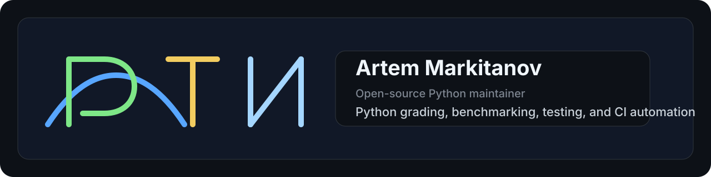

<p align="left">
  
</p>

<h3 align="left">Open-source Python maintainer building grading, testing, benchmarking and CI automation tools.</h3>

<p align="left">
  I build practical developer tooling for checking, comparing, debugging and shipping Python code with more confidence.
</p>

<p align="left">
  <a href="https://github.com/ArtVsMark/Stepik-Python-Grader"></a>
  <a href="https://pypi.org/project/stepik-python-grader/"></a>
  <a href="https://github.com/ArtVsMark/Stepik-Python-Grader/blob/main/LICENSE"></a>
  <a href="https://github.com/ArtVsMark?tab=followers"></a>
</p>

---

## Engineering profile

I maintain tools for workflows that need more than a simple “works / doesn’t work” result.

My focus sits at the intersection of:

`Python tooling` · `local grading & test orchestration` · `benchmark-driven comparison` · `CI/CD automation` · `contributor experience` · `documentation systems that stay usable as the codebase grows`

---

## What I maintain

### 🎓 Stepik-Python-Grader

> Local offline autograder for Python: run, benchmark and compare solutions, with an optional OS sandbox and web UI.

<p align="left">
  <a href="https://github.com/ArtVsMark/Stepik-Python-Grader/releases"></a>
  <a href="https://github.com/ArtVsMark/Stepik-Python-Grader/actions/workflows/ci.yml"></a>
  
  <a href="https://github.com/ArtVsMark/Stepik-Python-Grader/commits/main"></a>
</p>

A local grader for Stepik Python courses — and for any folder of solutions and test cases. It can:

- download task data automatically,
- run correctness checks locally, without a submit limit,
- compare multiple solutions more honestly — correctness first, benchmark metrics second,
- and expose the whole workflow through **CLI**, **local web UI**, **GUI launcher** and a **pytest plugin**.

<details>
<summary><b>Beyond basic test execution</b></summary>

<br />

| Capability | What it does |
|---|---|
| 🔍 **Offline glossary** | Bilingual RU/EN Python glossary, reachable straight from the error you just hit |
| 🧭 **Trace-based debugging** | Step-by-step tracer with a memory graph |
| ⏱️ **Subprocess benchmarking** | `timeit` microbenchmarks plus time and memory ranking across solutions |
| 🛡️ **OS-level sandboxing** | Optional execution boundary for Linux, macOS and Windows |
| 🤖 **AI failure explanations** | Opt-in, bring-your-own-key — never on by default |
| 📈 **Progress & history** | Tracks your recurring mistakes so they can be revisited |
| 📚 **Layered docs** | Split by audience: `use` · `dev` · `agent` · `audit` · `archive` |

</details>

<p align="left">
  <a href="https://github.com/ArtVsMark/Stepik-Python-Grader">Repository</a> ·
  <a href="https://pypi.org/project/stepik-python-grader/">PyPI package</a> ·
  <a href="https://github.com/ArtVsMark/Stepik-Python-Grader/blob/main/README.en.md">English quick start</a> ·
  <a href="https://github.com/ArtVsMark/Stepik-Python-Grader/blob/main/HISTORY.md">Project history</a>
</p>

```bash
pipx install stepik-python-grader && stepik-grader
```

### 📖 Glossary-Python

A glossary project for people learning Python — the vocabulary layer the grader links into when a run fails.

<p align="left">
  <a href="https://github.com/ArtVsMark/Glossary-Python">Repository</a>
</p>

---

## Selected signal

<p align="left">
  <a href="https://github.com/ArtVsMark/Stepik-Python-Grader/pulls?q=is%3Apr+is%3Aclosed"></a>
  <a href="https://github.com/ArtVsMark/Stepik-Python-Grader/graphs/commit-activity"></a>
  <a href="https://github.com/ArtVsMark/Stepik-Python-Grader/graphs/contributors"></a>
  <a href="https://github.com/ArtVsMark/Stepik-Python-Grader/issues"></a>
  <a href="https://github.com/ArtVsMark/Stepik-Python-Grader/network/members"></a>
</p>

**Eleven releases**, `v1.0.0` → `v1.10.0`, shipped since the first stable cut — on the back of **close to six hundred merged pull requests**, a **197-module test suite**, a merge-queue-gated CI matrix across Linux, macOS and Windows, and a changelog assembled from fragments rather than written after the fact.

I like shipping systems that are visible in the repo history: tests, release flow, changelog discipline, security posture, docs structure and merge automation.

---

## How I work

- Build around repeatable workflows, not one-off fixes.
- Prefer measurable quality: tests, benchmarks, typed boundaries and explicit invariants.
- Keep docs close to the code and split by audience.
- Treat repository operations as product surface, not maintenance noise.
- Optimize for maintainability, reviewability and long-term project clarity.

---

## Current focus

Pushing Stepik-Python-Grader further in these directions:

<table>
<tr><td>🏗️</td><td><b>Architecture refinement</b></td><td>keeping module boundaries honest as surface area grows</td></tr>
<tr><td>⚙️</td><td><b>CI &amp; merge automation</b></td><td>stronger gates, less manual shepherding</td></tr>
<tr><td>🧪</td><td><b>Regression coverage</b></td><td>every fixed bug leaves a test behind</td></tr>
<tr><td>🌍</td><td><b>English documentation</b></td><td>full parity with the Russian docs tree</td></tr>
<tr><td>🖥️</td><td><b>Local web UX</b></td><td>making <code>--serve</code> the primary workflow, not the fallback</td></tr>
<tr><td>🔒</td><td><b>Safer execution</b></td><td>tighter boundaries for untrusted code paths</td></tr>
</table>

---

## Stack

<p align="left">
  
  
  
  
  
  
  
  
  
  
</p>

```text
CLI tooling · local web UI · benchmarking · OS sandboxing · docs architecture
release automation · merge queues · typed boundaries · property-based testing
```

---

## Contact surface

<p align="left">
  <a href="https://github.com/ArtVsMark"></a>
  <a href="https://github.com/ArtVsMark/Stepik-Python-Grader/discussions"></a>
  <a href="https://github.com/ArtVsMark/Stepik-Python-Grader/issues/new/choose"></a>
</p>

<p align="left">
  <sub>Practical Python tooling for checking, comparing, debugging and shipping code with more confidence.</sub>
</p>
